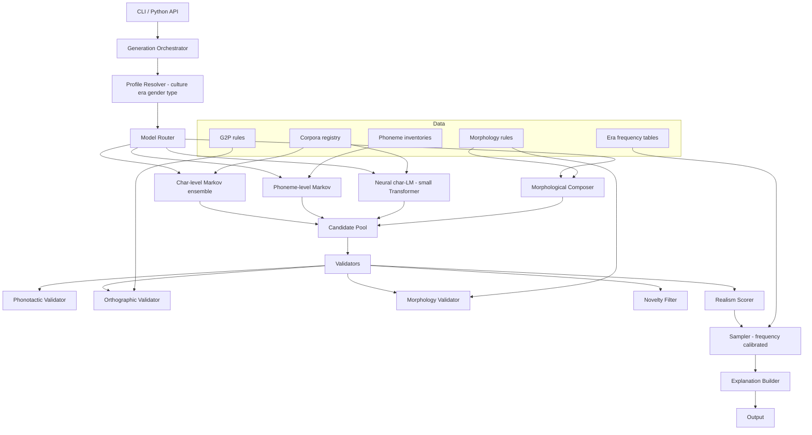

# namegen: The World's Most Realistic (Over)engineered Name Generator

A Python-first library and CLI focused on **linguistic realism**: names that obey the phonotactics, morphology, orthography, and socio-historical distributions of real naming traditions. Infrastructure stays minimal; rigor lives in the data and the models. A web API/UI is explicitly deferred.

---

## 1. Goals and Non-Goals

### Goals
- Generate names that a native speaker of a given tradition would plausibly accept as real.
- Support conditioning on **culture/region, language, era, gender, social class, and name type** (given, patronymic, surname, full name, compound, dynastic, etc.).
- Provide *calibrated realism*: outputs mirror true frequency distributions (Zipfian), not just "valid strings."
- Explain every generated name: which model produced it, which corpus informed it, confidence, novelty vs. memorization.
- Reproducibility: seeded, versioned models and datasets; deterministic CLI runs.

### Non-Goals (for v1)
- No web UI, no hosted API, no auth, no multi-tenant infra.
- No real-person impersonation features; explicit novelty filter against training corpora.
- No "fantasy race" generators beyond what falls out naturally from linguistic models.

---

## 2. Definition of "Realistic"

A name counts as realistic when it satisfies **all** of:
1. **Phonotactic validity**: its phoneme sequence is legal in the target language.
2. **Orthographic plausibility**: spelling follows language-specific grapheme-to-phoneme conventions.
3. **Morphological well-formedness**: patronymic/matronymic suffixes, gendered endings, compound rules, tonal/diacritic rules.
4. **Distributional fit**: frequency profile matches the target era/region (rare names are rare, common ones common).
5. **Socio-historical consistency**: the name could co-occur plausibly with the requested era and region (no 12th-century Norse babies named after 20th-century coinages).
6. **Novelty**: not a verbatim copy of a corpus entry unless explicitly requested.

Each axis gets its own scorer; a composite **Realism Score** is returned with every name.

---

## 3. Architecture Overview



### Layering
- **Core library** (`namegen/`): pure Python, no I/O side effects, deterministic given seed.
- **Data layer** (`namegen/data/`): versioned corpora + rule packs loaded as artifacts.
- **Models layer** (`namegen/models/`): training + inference for statistical/neural components.
- **CLI** (`namegen/cli/`): thin wrapper using `typer` or `click`.

---

## 4. Linguistic Modeling Strategy

### 4.1 Hybrid generator ensemble
For each `(language, era)` profile we train and ship:
- **Character-level Markov** (orders 3-6 with Kneser-Ney smoothing) - fast, strong local phonotactics.
- **Phoneme-level Markov** on G2P-transcribed corpora - captures sound patterns the orthography hides.
- **Small character Transformer** (~1-5M params, trained per language family) - captures longer-range structure and rare-but-valid combinations.
- **Rule-based morphological composer** - assembles roots + affixes for languages where that matters (Slavic patronymics, Icelandic `-son`/`-dottir`, Arabic `ibn`/`bint`, Spanish double surnames, Japanese kanji composition).

The router picks and blends models by language: e.g., Finnish leans heavily on phoneme Markov + vowel-harmony rules; Japanese uses kanji composition + kana phonotactics; English uses the Transformer + era frequency table.

### 4.2 Conditioning
Conditioning vector: `{language, region, era_bucket, gender, class, name_slot}`.
- Markov models: separate model per bucket, or a single model with prepended control tokens.
- Transformer: control tokens prepended (`<lang:sv>`, `<era:1800-1850>`, `<gender:f>`).
- Morphology: rule packs selected by profile.

### 4.3 Frequency calibration
Raw model samples are re-weighted against empirical era frequency tables so output distributions are Zipfian-correct, not uniform over the latent space.

### 4.4 Validators
Each validator returns a score in [0,1] plus a reason string:
- **Phonotactic**: onset/coda legality, sonority sequencing, language-specific constraints (vowel harmony, gemination rules).
- **Orthographic**: G2P round-trip stability, diacritic legality, capitalization conventions.
- **Morphological**: affix agreement, gendered endings, compound boundaries.
- **Novelty**: edit-distance + n-gram overlap vs. training corpora; flag near-duplicates of real people in a curated "do not impersonate" list (public figures).

### 4.5 Realism Score
Weighted geometric mean of validator scores, with weights tuned per language via small human-rated dev sets.

---

## 5. Data Strategy

### 5.1 Corpora sources (license-aware)
- Public-domain census data (US SSA, UK ONS, France INSEE, etc.).
- Wikipedia/Wikidata people entities with birth year + nationality (for era buckets).
- Historical registers in the public domain (ship manifests, church records digitized by archives).
- Open linguistic resources: PHOIBLE (phoneme inventories), WALS (typology), Wiktionary (G2P seeds), Unimorph (morphology).

### 5.2 Data contracts
Every corpus entry normalized to:
```
{name, name_slot, language, region, era, gender?, source, license, confidence}
```
Stored as Parquet, content-addressed, registered in a `corpora.yaml` manifest with checksums and license tags. Build is reproducible from manifest.

### 5.3 Rule packs
Per-language YAML files defining:
- phoneme inventory, allowed onsets/codas, syllable template
- G2P rules (or pointer to a trained G2P model)
- morphology: affix tables, gender agreement, compound rules
- era buckets and frequency table file
- orthographic conventions (diacritics, capitalization, scripts)

### 5.4 Ethics and safety
- **Do-not-impersonate list**: notable real people filtered from outputs.
- **Slur filter**: curated blocklists per language; validator rejects profane collisions.
- **Cultural review**: rule packs for sensitive traditions (Indigenous names, religious naming) are opt-in and flagged; we do not ship generators for traditions where generation itself is considered inappropriate without community input.
- **License tags** carried through to every generated name's provenance record.

---

## 6. Public API (Python)

```python
from namegen import Generator, Profile

g = Generator.load("default")  # loads bundled model bundle
profile = Profile(language="sv", era="1850-1900", gender="f", slot="full")

result = g.generate(profile, n=5, seed=42, explain=True)
for name in result:
    print(name.text, name.realism, name.explanation)
```

- `Generator` is immutable once loaded; all randomness goes through an injected `numpy.random.Generator`.
- `Profile` is a frozen dataclass; invalid combinations raise `ProfileError` with suggestions.
- `generate()` returns `list[GeneratedName]` with `text`, `realism`, `components`, `models_used`, `provenance`, `novelty`.

---

## 7. CLI

Using `typer`:
- `namegen generate --lang sv --era 1850-1900 --gender f --n 10 --seed 42 --explain`
- `namegen profiles list` / `namegen profiles show sv`
- `namegen validate "Astrid Bergsdotter" --lang sv --era 1850-1900` -> per-validator breakdown
- `namegen models list` / `namegen models download <bundle>`
- `namegen train --config configs/sv.yaml` (dev-only, behind extra install)

Output formats: pretty table (default), JSON, JSONL, CSV.

---

## 8. Repository Layout

```
namegen/
  __init__.py
  api.py                  # Generator, Profile, GeneratedName
  orchestrator.py
  profile.py
  models/
    markov.py
    phoneme_markov.py
    transformer.py
    morphology.py
    router.py
  validators/
    phonotactic.py
    orthographic.py
    morphology.py
    novelty.py
    scorer.py
  data/
    loaders.py
    corpora.yaml
    rules/
      sv.yaml
      en.yaml
      ja.yaml
      ...
  g2p/
    engine.py
    rules/
  sampling/
    frequency.py
  cli/
    main.py
configs/
  training/
    sv.yaml
    ...
scripts/
  build_corpora.py
  train_model.py
  eval_realism.py
tests/
  unit/
  property/
  golden/
benchmarks/
docs/
```

---

## 9. Evaluation and Benchmarks

- **Automatic metrics**: perplexity vs. held-out names, JS divergence of character n-gram distributions, phonotactic legality rate, novelty rate, duplication rate.
- **Human evaluation**: small rater panels per language score 200 generated vs. 200 real names; target > 0.45 confusion (hard-to-distinguish).
- **Era calibration**: KL divergence between generated-era distribution and empirical era distribution.
- **Regression suite**: golden seeds produce identical output across versions; any change requires a benchmark diff review.

---

## 10. Tooling and Quality Bar

- Python 3.11+, `pyproject.toml`, `uv` or `poetry` for deps.
- `ruff` + `mypy --strict` + `pytest` + `hypothesis` for property tests.
- `pre-commit` hooks. CI on GitHub Actions: lint, type, test, build model bundle smoke-test.
- Docs via `mkdocs-material`; every rule pack documented with sources and caveats.
- Semantic versioning. Models and rule packs versioned independently of library code; the library pins compatible bundle versions.

---

## 11. Milestones (ordered, no estimates)

### M1. Skeleton and contracts
Project scaffolding, packaging, CI, core types (`Profile`, `GeneratedName`), `Generator` interface stubs, CLI shell.

### M2. Data pipeline v1
Corpora manifest format, license tagging, loader, first two languages (English + Swedish) ingested end-to-end to Parquet with era buckets.

### M3. Baseline generators
Character Markov with Kneser-Ney; naive validator stubs; `generate` returns something; golden tests established.

### M4. G2P + phoneme Markov
G2P engine (rule-based first, trainable fallback), phoneme-level Markov, phonotactic validator wired in.

### M5. Morphology layer
Rule pack schema, morphological composer, morphology validator; add Icelandic and Russian to prove patronymic handling.

### M6. Neural generator
Small per-family Transformer, control-token conditioning, training scripts, eval harness, bundle packaging.

### M7. Realism scorer + frequency calibration
Composite scorer, Zipf-correct sampler, novelty filter with do-not-impersonate list.

### M8. Explanation and provenance
Per-name explanation object, provenance records carrying licenses and model/bundle versions.

### M9. Evaluation harness
Automatic metrics, human-eval tooling (CLI to export rating sheets), era calibration reports, regression benchmark.

### M10. Language expansion
Add Japanese (kanji composition), Arabic (root-and-pattern + nasab), Spanish (double surnames), Finnish (vowel harmony), Yoruba (tone) as stress tests of the framework.

### M11. Hardening and 1.0
Docs, tutorials, stable bundle format, SemVer freeze, ethics review pass, 1.0 release.

### Deferred (post-1.0)
FastAPI service, web UI, hosted model registry, multi-tenant rate limiting, streaming generation, embeddings-based "name like X" queries.

---

## 12. Risks and Mitigations

| Risk | Mitigation |
|---|---|
| Corpora licenses vary and contaminate outputs | Strict manifest with license tags; novelty filter; provenance on every output |
| Cultural insensitivity in some traditions | Opt-in rule packs, documented caveats, community review before shipping |
| Over-memorization of rare real names | Novelty filter + edit-distance threshold + do-not-impersonate list |
| Scope creep into UI/API | Hard gate: no web deliverables until 1.0 |
| Neural model bloat | Cap per-family Transformer size; ship quantized; allow Markov-only install extra |
| Reproducibility drift | Content-addressed data, pinned bundles, golden seed tests in CI |
| Evaluation is subjective | Combine automatic metrics with small structured human panels; publish methodology |

---

## 13. Open Questions to Resolve Before M2

1. Which 2-3 launch languages beyond English? (Plan assumes Swedish + Icelandic as early rigor-testers; confirm.)
2. Acceptable model size ceiling for the bundled default install (affects whether Transformer is default or opt-in extra).
3. Policy for modern vs. historical eras: how far back do we claim competence? Proposal: cap at earliest era with >=1k attested names per bucket.
4. Do-not-impersonate list source and update cadence (Wikidata query + manual curation suggested).
5. Human evaluation budget and rater sourcing for the realism benchmark.
